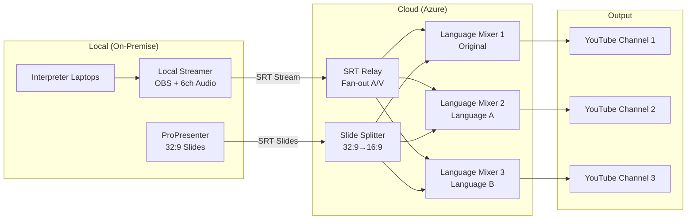

# Multilingual Live Streaming System

**Version:** 3.1  
**Purpose:** On-demand cloud-based multilingual streaming platform  
**Deployment:** 10-15 minutes setup, zero costs when idle  

## 🎯 Overview

This system provides **one-click deployment and teardown** for multilingual live streaming events. Stream audio/video from interpreters and presenters to multiple YouTube channels simultaneously with automatic cloud processing.

### Key Features
- ⚡ **Fast Setup**: Complete system ready in 10-15 minutes
- 💰 **Cost Optimization**: Zero costs when not streaming ($5-10 per 4-hour event)
- 🎯 **One-Click Operation**: Simple deployment and teardown via web interface
- 🌍 **Multi-Language**: Support for unlimited language channels
- 🔄 **Repeatable**: Consistent setup across events
- 🛡️ **Automatic Cleanup**: Prevents resource sprawl

## 🚀 Quick Start

### 1. Deploy System
```bash
# Option A: Web Dashboard (Recommended)
open web-dashboard.html

# Option B: Command Line
./stream-control.sh deploy --event "My-Event-2025" --youtube-keys "key1,key2,key3"

# Option C: Direct Ansible
ansible-playbook -i ansible/inventories/production site.yml \
  -e event_name="My-Event-2025" -e youtube_keys="key1,key2,key3"
```

### 2. Connect Sources
- **Local Streamer**: Stream SRT to provided relay IP
- **ProPresenter**: Stream slides to provided splitter IP  
- **Mixers**: RDP to provided IPs, start streaming to YouTube

### 3. Teardown
```bash
./stream-control.sh teardown --event "My-Event-2025" --confirm
```

## 📖 Documentation

### 📋 **For Event Operations Teams**
- **[📖 Operations Guide](docs/OPERATIONS.md)** - Complete event day procedures, troubleshooting, monitoring
- **[📄 Quick Reference](docs/QUICK-REFERENCE.md)** - Print-friendly at-a-glance information
- **[📊 Report Template](docs/POST-EVENT-TEMPLATE.md)** - Structured post-event analysis

### 🔧 **For Technical Teams**  
- **[🏗️ Architecture](docs/ARCHITECTURE.md)** - System design and technical specifications
- **[⚙️ Deployment](docs/DEPLOYMENT.md)** - Infrastructure setup and configuration
- **[🛠️ Development](docs/DEVELOPMENT.md)** - Contributing and customization guide

### 📚 **Additional Resources**
- **[🔐 Security](docs/SECURITY.md)** - Security configuration and best practices
- **[📈 Monitoring](docs/MONITORING.md)** - Performance monitoring and alerting
- **[❓ FAQ](docs/FAQ.md)** - Common questions and troubleshooting

## 🏗️ System Architecture



### Component Overview
| Component | Purpose | Technology | Cost/Hour |
|-----------|---------|------------|-----------|
| **SRT Relay** | Receive and fan-out A/V stream | Azure Container Instance | ~$0.10 |
| **Slide Splitter** | Convert 32:9 slides to 16:9 | Azure Container Instance | ~$0.05 |
| **Language Mixers** | Mix A/V + slides, stream to YouTube | Windows VMs with OBS | ~$0.50 each |
| **Networking** | VNet, security groups, public IPs | Azure Infrastructure | ~$0.05 |
| **Total** | **Full system operational cost** | | **~$1.70/hour** |

## 📋 Prerequisites

### Required Software
```bash
# Install dependencies
pip install ansible
az login
git clone https://github.com/YOUR-ORG/streaming-system.git
cd streaming-system
```

### Required Permissions
- Azure subscription with Contributor role
- Ability to create VMs, containers, and networking
- YouTube channel admin access for RTMP keys

### Environment Setup
```bash
export AZURE_SUBSCRIPTION_ID="your-subscription-id"
export AZURE_TENANT_ID="your-tenant-id"  
export AZURE_CLIENT_ID="your-client-id"
export AZURE_SECRET="your-client-secret"
```

## 🎮 Usage Scenarios

### Scenario 1: Conference with 3 Languages
```bash
# Deploy for English, Spanish, French
./stream-control.sh deploy \
  --event "Tech-Conference-2025" \
  --languages "english,spanish,french" \
  --youtube-keys "eng_key,esp_key,fra_key"

# Duration: ~4 hours, Cost: ~$7
```

### Scenario 2: Webinar with Original + 1 Translation  
```bash
# Deploy for original + Spanish
./stream-control.sh deploy \
  --event "Product-Webinar" \
  --languages "original,spanish" \
  --youtube-keys "main_key,spanish_key"

# Duration: ~2 hours, Cost: ~$3
```

### Scenario 3: Global Event with 5 Languages
```bash
# Deploy for multiple languages
./stream-control.sh deploy \
  --event "Global-Summit-2025" \
  --languages "english,spanish,french,german,portuguese" \
  --youtube-keys "key1,key2,key3,key4,key5"

# Duration: ~6 hours, Cost: ~$15
```

## ⚠️ Important Operational Notes

### **🚨 Critical Success Factors**
1. **Test deployment 2 hours before event** - Full system validation
2. **Have backup YouTube keys ready** - In case of stream key issues  
3. **Verify audio channel mapping** - Each mixer receives correct language
4. **Monitor throughout event** - Use provided monitoring dashboard
5. **Teardown immediately after** - Avoid unnecessary costs

### **📞 Emergency Contacts**
- **Operations Lead**: _________ | _________
- **Technical Lead**: _________ | _________  
- **Azure Support**: _________ | _________

### **🔗 Quick Access URLs**
- **Azure Portal**: [portal.azure.com](https://portal.azure.com)
- **YouTube Studio**: [studio.youtube.com](https://studio.youtube.com)
- **GitHub Actions**: `github.com/YOUR-ORG/YOUR-REPO/actions`

## 🤝 Support & Contributing

### Getting Help
1. **Check the [Operations Guide](docs/OPERATIONS.md)** for event day issues
2. **Review [Troubleshooting](docs/OPERATIONS.md#troubleshooting)** for common problems
3. **Test with a new event name** if deployment fails
4. **Contact technical team** if issues persist

### Contributing
1. Fork repository and create feature branch
2. Update relevant documentation
3. Test changes thoroughly
4. Submit pull request with clear description

### License
MIT License - see [LICENSE](LICENSE) for details

---

**Ready to stream? 🚀**

```bash
# Quick test deployment
./stream-control.sh deploy --event "Test-$(date +%Y%m%d)" --youtube-keys "test1,test2,test3"
```

**Need help?** Start with the [📖 Operations Guide](docs/OPERATIONS.md) 