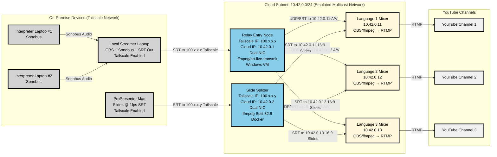

**Title:** Streaming System Specification for Multilingual Hybrid Live Pipeline

**Version:** 3.1
**Author:** \[Your Name]
**Date:** \[Today's Date]

---

### **1. Objective**

Establish a scalable, automated, and fault-tolerant streaming system that:

* Captures audio and video from distributed interpreters and presenters
* Relays and mixes these streams in the cloud
* Distributes finalized content to multiple YouTube channels in different languages
* Uses Tailscale for secure ingress and Ansible for full configuration and control

---

### **2. Network Architecture Diagram**



---

### **3. System Architecture**

#### **3.1 Local Infrastructure (On-Premise)**

##### **3.1.1 Interpreter Laptops (#1 and #2)**

**Hardware Requirements:**
- **CPU**: Dual-core 2.5GHz minimum
- **RAM**: 8 GB minimum
- **Network**: Stable internet connection (10 Mbps upload)
- **Audio**: USB headset with microphone
- **OS**: Windows 10/11 (64-bit)

**Software Requirements:**
- **Primary**: Sonobus v1.7+ for audio transmission
- **Audio Drivers**: ASIO4ALL or manufacturer-specific ASIO drivers
- **Network**: Windows built-in networking stack
- **Runtime**: Microsoft Visual C++ Redistributable 2019+
- **Optional**: VoiceMeeter for advanced audio routing

**Software Configuration:**
- **Sonobus Settings**: 48kHz, 16-bit, low-latency mode (<20ms buffer)
- **Audio Interface**: USB headset configured as default device
- **Network**: Direct connection to Local Streamer via IP
- **Quality**: Uncompressed PCM transmission

**Stream Specifications:**
- **Audio Output**: Uncompressed PCM to Sonobus
- **Latency**: <50ms to Local Streamer
- **Quality**: Broadcast-quality interpretation audio

**Purpose**: Capture and transmit real-time interpreter audio to Local Streamer

##### **3.1.2 Local Streamer Laptop**

**Hardware Requirements:**
- **CPU**: Quad-core 3.0GHz minimum (i7/Ryzen 7 recommended)
- **RAM**: 16 GB minimum
- **GPU**: Dedicated GPU recommended for OBS encoding (GTX 1660/RTX 3060 or better)
- **Network**: 25 Mbps upload minimum
- **Audio**: Professional audio interface recommended
- **OS**: Windows 10/11 (64-bit)

**Software Requirements:**
- **Primary**: OBS Studio v29+ for video mixing and streaming
- **Audio**: Sonobus v1.7+ for interpreter input
- **Audio Routing**: VB-Cable or VoiceMeeter Potato for complex audio routing
- **Network**: Tailscale v1.50+ VPN client
- **Encoding**: OBS with hardware acceleration plugins
- **Runtime**: Microsoft Visual C++ Redistributable 2019+, .NET Framework 4.8+
- **Drivers**: Latest GPU drivers (NVIDIA/AMD), ASIO audio drivers

**Software Configuration:**
- **OBS Studio**: 
  - Hardware encoding (NVENC/AMF/QuickSync)
  - 6-channel audio output configuration
  - SRT output plugin configured
- **Sonobus**: Configured for 2x interpreter inputs
- **VB-Cable/VoiceMeeter**: Multi-channel audio routing setup
- **Tailscale**: Auto-connect to mesh network
- **Windows Audio**: Exclusive mode disabled for shared access

**Stream Specifications:**
- **Video Output**: 1920x1080 @ 30fps, H.264, 5-8 Mbps
- **Audio Output**: 48kHz, 16-bit, 6-channel AAC, 384 kbps
  - Channels 1-2: Original presenter audio (stereo)
  - Channels 3-4: Interpreter 1 audio (Language A, stereo)
  - Channels 5-6: Interpreter 2 audio (Language B, stereo)
- **Protocol**: SRT with 200ms latency buffer
- **Destination**: Relay Entry Node via Tailscale (100.x.x.x:9998)

**Purpose**: Mix local video, presenter audio, and interpreter audio; stream to cloud via SRT

##### **3.1.3 ProPresenter Mac**

**Hardware Requirements:**
- **CPU**: Apple Silicon M1 or Intel i5 minimum
- **RAM**: 8 GB minimum
- **Network**: 10 Mbps upload minimum
- **Storage**: 100 GB available for presentation files
- **OS**: macOS 12.0+ (Monterey or newer)

**Software Requirements:**
- **Primary**: ProPresenter 7.12+ for slide presentation
- **Network**: Tailscale v1.50+ VPN client
- **Streaming**: ProPresenter SRT output module
- **Runtime**: Latest macOS system updates
- **Optional**: OBS Studio v29+ as backup streaming solution

**Software Configuration:**
- **ProPresenter**: 
  - SRT streaming module enabled
  - 32:9 output resolution configured
  - 1fps output for bandwidth optimization
- **Tailscale**: Auto-connect to mesh network
- **macOS**: Network optimization for streaming
- **Display**: Extended desktop for operator control + output

**Stream Specifications:**
- **Video Output**: 3840x1080 (32:9) @ 1fps, H.264, 1 Mbps
- **Audio**: None (slides only)
- **Protocol**: SRT
- **Destination**: Slide Splitter via Tailscale (100.x.x.y:9999)
- **Note**: 1fps optimizes bandwidth for static slide content

**Purpose**: Output ultra-wide slide presentation for splitting and distribution

#### **3.2 Cloud Infrastructure**

##### **3.2.1 Relay Entry Node (Linux VM)**

**Hardware Specifications:**
- **CPU**: 4 vCPUs (Intel/AMD x64)
- **RAM**: 8 GB
- **Storage**: 50 GB SSD
- **Network**: 100 Mbps sustained, dual NIC support
- **OS**: Ubuntu 22.04 LTS Server
- **Location**: Azure or other cloud provider

**Software Requirements:**
- **Primary**: ffmpeg v5.0+ (recommended for multi-destination fan-out)
- **Alternative**: Multiple srt-live-transmit v1.5+ instances
- **Container**: Docker v24.0+ and Docker Compose v2.0+
- **Network**: Tailscale v1.50+ for mesh connectivity
- **Monitoring**: Prometheus node-exporter, rsyslog
- **System**: systemd for service management
- **Security**: ufw firewall, fail2ban

**Network Configuration:**
- **Primary NIC**: Tailscale mesh (100.x.x.x)
- **Secondary NIC**: Internal cloud subnet (10.42.0.1/24)
- **Firewall Rules**:
  - Inbound: Tailscale (41641/udp), SRT (9998/udp)
  - Outbound: Internal subnet (10.42.0.0/24), DNS (53)

**Software Configuration:**
- **Primary**: ffmpeg v5.0+ (recommended for multi-destination fan-out)
- **Alternative**: Multiple srt-live-transmit v1.5+ instances
- **Docker Service**: SRT relay container with auto-restart
- **Fan-out Method**: Single ffmpeg process with 3 SRT outputs
- **Tailscale**: Systemd service with auto-connect
- **Logging**: Centralized log forwarding to syslog
- **Monitoring**: Health check endpoints exposed

**Stream Processing:**
- **Input**: SRT stream from Local Streamer (1920x1080@30fps, 6-channel audio)
- **Processing**: Stream copy (no transcoding) with fan-out to 3 destinations
- **ffmpeg Command**: 
  ```bash
  ffmpeg -i srt://:9998 \
    -c copy -f mpegts srt://10.42.0.11:8001 \
    -c copy -f mpegts srt://10.42.0.12:8001 \
    -c copy -f mpegts srt://10.42.0.13:8001
  ```
- **Output**: 3x identical SRT streams to Language Mixers
- **Bandwidth**: 24 Mbps total output (8 Mbps × 3)

**Purpose**: Receive high-quality A/V stream and distribute to all language mixers

##### **3.2.2 Slide Splitter (Docker Container)**

**Hardware Specifications:**
- **CPU**: 2 vCPUs
- **RAM**: 4 GB
- **Storage**: 20 GB SSD
- **Network**: 50 Mbps sustained, dual NIC support
- **OS**: Ubuntu 22.04 LTS with Docker
- **Location**: Cloud VM with Tailscale and internal subnet access

**Software Requirements:**
- **Container Runtime**: Docker v24.0+ and Docker Compose v2.0+
- **Primary**: Custom ffmpeg v5.0+ based Docker image
- **Network**: Tailscale v1.50+ for mesh connectivity
- **Monitoring**: Prometheus node-exporter, container health checks
- **System**: systemd for Docker service management
- **Security**: ufw firewall, Docker security profiles

**Network Configuration:**
- **Primary NIC**: Tailscale mesh (100.x.x.y)
- **Secondary NIC**: Internal cloud subnet (10.42.0.2/24)
- **Firewall Rules**:
  - Inbound: Tailscale (41641/udp), SRT (9999/udp)
  - Outbound: Internal subnet (10.42.0.0/24), DNS (53)

**Software Configuration:**
- **Docker Container**: Custom ffmpeg image with SRT support
- **Docker Compose**: Multi-container setup with health checks
- **ffmpeg**: Video scaling and cropping pipeline
- **Tailscale**: Container networking integration
- **Monitoring**: Container metrics and log forwarding

**Stream Processing:**
- **Input**: SRT stream from ProPresenter (3840x1080@1fps)
- **Processing**: Scale and crop 32:9 to 16:9 format
- **Output**: 3x identical SRT streams (1920x1080@1fps)
  - Mixer 1: 10.42.0.11:8002
  - Mixer 2: 10.42.0.12:8002
  - Mixer 3: 10.42.0.13:8002
- **Bandwidth**: 3 Mbps total output (1 Mbps × 3)

**Purpose**: Convert ultra-wide slides to standard format and distribute to all mixers

##### **3.2.3 Language Mixers (3x Windows VMs)**

**Hardware Specifications (per VM):**
- **CPU**: 4 vCPUs each
- **RAM**: 8 GB each
- **Storage**: 50 GB SSD each
- **Network**: 50 Mbps sustained each
- **OS**: Windows Server 2022 (or Windows 10/11 Pro)
- **Location**: Cloud subnet 10.42.0.0/24

**Software Requirements (per VM):**
- **Primary**: OBS Studio v29+ for video mixing and streaming
- **Alternative**: ffmpeg v5.0+ for command-line mixing
- **Runtime**: Microsoft Visual C++ Redistributable 2019+, .NET Framework 4.8+
- **Monitoring**: Prometheus windows-exporter, Windows Event Log
- **System**: Windows Service management for auto-restart
- **Security**: Windows Defender Firewall, Windows Updates

**Network Configuration:**
- **IP Addresses**: 10.42.0.11, 10.42.0.12, 10.42.0.13
- **Firewall Rules**:
  - Inbound: Internal subnet (8001-8002/tcp)
  - Outbound: YouTube RTMP (1935/tcp), DNS (53)

**Software Configuration:**
- **OBS Studio**: 
  - SRT input sources configured
  - Hardware encoding if available
  - RTMP output to YouTube
  - Audio channel mapping filters
- **Windows Services**: OBS or ffmpeg as Windows Service
- **Audio Processing**: Channel selection and stereo downmix
- **Monitoring**: Performance counters and log forwarding

**Stream Processing:**

**Mixer 1 (Original Language):**
- **A/V Input**: SRT from Relay (10.42.0.11:8001)
- **Slide Input**: SRT from Splitter (10.42.0.11:8002)
- **Audio Selection**: Channels 1-2 (Original presenter)
- **Output**: 1920x1080@30fps, stereo audio, 6 Mbps RTMP
- **Destination**: YouTube Channel 1

**Mixer 2 (Language A):**
- **A/V Input**: SRT from Relay (10.42.0.12:8001)
- **Slide Input**: SRT from Splitter (10.42.0.12:8002)
- **Audio Selection**: Channels 3-4 (Interpreter 1)
- **Output**: 1920x1080@30fps, stereo audio, 6 Mbps RTMP
- **Destination**: YouTube Channel 2

**Mixer 3 (Language B):**
- **A/V Input**: SRT from Relay (10.42.0.13:8001)
- **Slide Input**: SRT from Splitter (10.42.0.13:8002)
- **Audio Selection**: Channels 5-6 (Interpreter 2)
- **Output**: 1920x1080@30fps, stereo audio, 6 Mbps RTMP
- **Destination**: YouTube Channel 3

**Audio Channel Mapping (ffmpeg):**
```bash
# Mixer 1 (Original)
-filter:a "pan=stereo|c0=c0|c1=c1"

# Mixer 2 (Language A) 
-filter:a "pan=stereo|c0=c2|c1=c3"

# Mixer 3 (Language B)
-filter:a "pan=stereo|c0=c4|c1=c5"
```

**Purpose**: Combine A/V and slides with language-specific audio, stream to YouTube

---

### **4. Network Architecture and Data Flow**

#### **4.1 Audio Synchronization Strategy**

**Buffer Management:**
- **200ms audio buffer** at each stage to maintain sync
- **Latency Compensation**: ffmpeg `-itsoffset` parameter for A/V alignment
- **Sync Monitoring**: Automated drift detection with ±50ms tolerance
- **Recovery**: Automatic buffer reset if sync drift exceeds 100ms

**Multi-Channel Audio Flow:**
1. **Interpreters** → Sonobus → **Local Streamer** (real-time mixing)
2. **Local Streamer** → 6-channel AAC → **Relay Entry Node** (SRT transport)
3. **Relay Entry Node** → Fan-out → **Language Mixers** (channel selection)
4. **Language Mixers** → Stereo extraction → **YouTube** (RTMP delivery)

#### **4.2 Bandwidth Allocation**

**Upstream (Local to Cloud):**
- Local Streamer: 8 Mbps (A/V stream)
- ProPresenter: 1 Mbps (slide stream)
- **Total**: 9 Mbps minimum upload

**Cloud Internal:**
- Relay fan-out: 24 Mbps (8 Mbps × 3 mixers)
- Slide distribution: 3 Mbps (1 Mbps × 3 mixers)

**Downstream (Cloud to YouTube):**
- Per mixer: 6 Mbps RTMP upload
- **Total**: 18 Mbps upload to YouTube

---

### **5. Stream Pipeline Overview**

* **Interpreter Audio** → Sonobus → Local Streamer
* **Local Video + Audio Mix** → OBS → SRT → Relay Entry Node
* **Slides** → ProPresenter → SRT → Slide Splitter → 3x 16:9 outputs (one per mixer)
* **Cloud Fan-out**: Relay forwards A/V to mixers, Slide Splitter forwards slides to all mixers
* **Language Mixers**: Receive A/V + slides → mix + encode → RTMP to YouTube

---

### **6. Automation and Configuration (Ansible)**

* **Provisioning**:

  * VM creation (manual or Terraform)
  * Hostnames, users, SSH keys
* **Configuration Management**:

  * Tailscale setup with auth keys
  * Installation of Docker, ffmpeg, srt-live-transmit, OBS
  * Deployment of systemd units or Docker Compose files
* **Secrets Management**:

  * RTMP keys, auth tokens stored in Ansible Vault
* **Inventory and Roles**:

  * Grouped by node type (relay, splitter, mixer, local)
  * Reusable roles for container setup, network config, tailscale auth

---

### **7. Monitoring and Maintenance**

* **Process Supervision**: systemd or Docker `--restart=always`
* **Logging**: Forwarded to centralized log collector or journal-based rotation
* **Health Checks**:

  * Port probes for SRT inputs
  * ffmpeg watchdogs
  * YouTube streaming health API integration (future)
* **Metrics and Dashboards**:

  * All system metrics (CPU, memory, network, stream status) collected via Prometheus node\_exporter or custom scripts
  * **Grafana** used for visualization and dashboarding of stream health, node uptime, and error rates
* **Alerting**: Grafana alerts, Email/Slack webhook from control node

---

### **8. Operational Procedures**

#### **8.1 System Startup Sequence**

**Phase 1: Infrastructure Preparation (5 minutes)**
1. **Verify Cloud Infrastructure**: Ensure all VMs are running and accessible
2. **Check Tailscale Connectivity**: Confirm all nodes are connected to mesh
3. **Validate Network Routes**: Test internal subnet connectivity (10.42.0.0/24)
4. **Start Core Services**: Launch Relay Entry Node and Slide Splitter containers

**Phase 2: Stream Preparation (3 minutes)**
5. **Initialize Language Mixers**: Start OBS/ffmpeg on all three mixer VMs
6. **Configure Audio Routing**: Set up 6-channel input mapping on each mixer
7. **Prepare YouTube Streams**: Verify RTMP endpoints and stream keys
8. **Test Internal Connectivity**: Confirm mixers can receive from relay/splitter

**Phase 3: Content Sources (2 minutes)**
9. **Start ProPresenter**: Begin slide output at 1fps to Slide Splitter
10. **Launch Interpreter Audio**: Connect Sonobus on both interpreter laptops
11. **Initialize Local Streamer**: Start OBS with 6-channel audio configuration
12. **Verify Signal Flow**: Confirm A/V and slides reaching all mixers

**Phase 4: Go Live (1 minute)**
13. **Final Quality Check**: Verify all streams show correct content
14. **Begin YouTube Streaming**: Start RTMP output from all three mixers
15. **Monitor Dashboard**: Confirm all streams are live and healthy

#### **8.2 Graceful Shutdown Sequence**

**Phase 1: Stop Streaming (1 minute)**
1. **End YouTube Streams**: Stop RTMP output from all mixers
2. **Stop Local Sources**: End OBS streaming and ProPresenter output
3. **Disconnect Interpreters**: Close Sonobus connections

**Phase 2: Cloud Cleanup (2 minutes)**
4. **Stop Language Mixers**: Gracefully shut down OBS/ffmpeg processes
5. **Stop Relay Services**: End SRT relay and slide splitter
6. **Archive Logs**: Collect and store session logs for analysis

#### **8.3 Failure Recovery Procedures**

**Relay Entry Node Failure:**
- **Detection**: Loss of A/V signal at all mixers
- **Recovery**: Restart relay VM, verify Tailscale connectivity
- **Fallback**: Manual ffmpeg relay from backup VM
- **RTO**: 2 minutes maximum

**Slide Splitter Failure:**
- **Detection**: Loss of slide content at mixers
- **Recovery**: Restart Docker container, verify ProPresenter connection
- **Fallback**: Direct SRT from ProPresenter to primary mixer
- **RTO**: 1 minute maximum

**Individual Mixer Failure:**
- **Detection**: Loss of specific language stream
- **Recovery**: Restart OBS/ffmpeg on affected VM
- **Fallback**: Continue with remaining language streams
- **RTO**: 3 minutes maximum

**Network Connectivity Issues:**
- **Tailscale Outage**: Switch to direct internet routing with VPN
- **Internal Subnet Issues**: Restart affected VMs, check routing tables
- **Internet Outage**: Activate backup internet connection

#### **8.4 Quality Assurance Procedures**

**Pre-Stream Checklist:**
- [ ] All VMs responding to ping
- [ ] Tailscale mesh fully connected
- [ ] Audio levels within -12dB to -6dB range
- [ ] Video quality at target bitrate
- [ ] Slide content displaying correctly
- [ ] All three language streams operational

**During Stream Monitoring:**
- **Every 5 minutes**: Check stream health dashboard
- **Every 15 minutes**: Verify YouTube viewer counts
- **Every 30 minutes**: Review audio/video sync status
- **Continuous**: Monitor automated alerts

**Post-Stream Analysis:**
- Review session logs for errors
- Analyze bandwidth utilization
- Check audio/video quality metrics
- Document any issues for improvement

---

### **9. Security Configuration**

#### **9.1 Tailscale Access Control Lists (ACLs)**

**Network Segmentation:**
```json
{
  "groups": {
    "group:local-devices": ["interpreter1", "interpreter2", "local-streamer", "propresenter"],
    "group:cloud-infrastructure": ["relay-entry", "slide-splitter"],
    "group:language-mixers": ["mixer1", "mixer2", "mixer3"]
  },
  "acls": [
    {
      "action": "accept",
      "src": ["group:local-devices"],
      "dst": ["group:cloud-infrastructure:9998-9999"]
    },
    {
      "action": "accept", 
      "src": ["group:cloud-infrastructure"],
      "dst": ["group:language-mixers:8001-8002"]
    },
    {
      "action": "deny",
      "src": ["*"],
      "dst": ["*"]
    }
  ]
}
```

**Access Restrictions:**
- **Local Devices**: Can only access designated cloud entry points
- **Cloud Infrastructure**: Internal communication within 10.42.0.0/24
- **Language Mixers**: Outbound RTMP to YouTube only
- **SSH Access**: Restricted to admin devices with MFA

#### **9.2 Secrets Management**

**Ansible Vault Structure:**
```yaml
# secrets.yml (encrypted)
youtube_rtmp_keys:
  channel1: "rtmp://a.rtmp.youtube.com/live2/xxxx-xxxx-xxxx-xxxx"
  channel2: "rtmp://a.rtmp.youtube.com/live2/yyyy-yyyy-yyyy-yyyy"
  channel3: "rtmp://a.rtmp.youtube.com/live2/zzzz-zzzz-zzzz-zzzz"

tailscale_auth_keys:
  relay_node: "tskey-auth-xxxxxx"
  slide_splitter: "tskey-auth-yyyyyy"
  
ssh_public_keys:
  admin: "ssh-rsa AAAAB3NzaC1yc2E..."
```

**Key Rotation Schedule:**
- **YouTube RTMP Keys**: Rotate monthly
- **Tailscale Auth Keys**: Rotate quarterly  
- **SSH Keys**: Rotate annually or on personnel changes
- **Ansible Vault Password**: Rotate bi-annually

#### **9.3 Network Security Groups**

**Cloud VM Firewall Rules:**

**Relay Entry Node:**
- **Inbound**: Tailscale (41641/udp), SRT (9998/udp)
- **Outbound**: Internal subnet (10.42.0.0/24), DNS (53)
- **Deny**: All other traffic

**Slide Splitter:**
- **Inbound**: Tailscale (41641/udp), SRT (9999/udp)
- **Outbound**: Internal subnet (10.42.0.0/24), DNS (53)
- **Deny**: All other traffic

**Language Mixers:**
- **Inbound**: Internal subnet (8001-8002/tcp)
- **Outbound**: YouTube RTMP (1935/tcp), DNS (53)
- **Deny**: All other traffic

#### **9.4 Authentication and Authorization**

**Multi-Factor Authentication:**
- **Required for**: SSH access to all VMs
- **Method**: TOTP (Google Authenticator, Authy)
- **Backup**: Recovery codes stored in secure vault

**Role-Based Access:**
- **Stream Operators**: Can start/stop streams, view monitoring
- **System Administrators**: Full system access, configuration changes
- **Viewers**: Read-only access to monitoring dashboards

**Session Management:**
- **SSH Sessions**: 4-hour timeout with activity monitoring
- **Ansible Execution**: Logged with user attribution
- **Emergency Access**: Break-glass procedure with audit trail

---

### **10. Testing and Validation**

#### **10.1 End-to-End Testing**

**Pre-Production Testing:**
1. **Load Testing**: Simulate full 3-language stream for 2 hours
2. **Failover Testing**: Deliberately fail each component and verify recovery
3. **Network Stress Testing**: Test with limited bandwidth conditions
4. **Audio Sync Testing**: Verify synchronization across all language streams

**Automated Testing Suite:**
```bash
#!/bin/bash
# Stream validation script
test_connectivity() {
  # Test Tailscale mesh connectivity
  # Verify SRT port accessibility  
  # Check internal routing
}

test_audio_sync() {
  # Generate test tone
  # Measure latency across pipeline
  # Verify channel mapping
}

test_stream_quality() {
  # Check video bitrate stability
  # Verify audio levels
  # Test slide synchronization
}
```

#### **10.2 Performance Benchmarking**

**Baseline Metrics:**
- **Stream Latency**: <500ms end-to-end
- **Audio Sync Tolerance**: ±50ms maximum drift
- **Video Quality**: Consistent 1080p30 with <1% frame drops
- **Uptime Target**: 99.9% availability during events

**Monitoring Thresholds:**
- **CPU Usage**: Alert at >80% sustained
- **Memory Usage**: Alert at >85% 
- **Network Bandwidth**: Alert at >90% of allocated
- **Stream Health**: Alert on any mixer failure

#### **10.3 Disaster Recovery Testing**

**Quarterly DR Drills:**
1. **Complete Infrastructure Failure**: Test backup cloud region deployment
2. **Internet Outage**: Validate backup connectivity options
3. **Personnel Unavailability**: Test documentation completeness
4. **Security Incident**: Practice incident response procedures

**Recovery Time Objectives:**
- **Single Component**: 2-3 minutes
- **Multiple Components**: 5-10 minutes  
- **Complete Infrastructure**: 15-30 minutes
- **Backup Region Activation**: 45-60 minutes

---

### **11. Future Enhancements**

#### **11.1 Short-term Improvements (3-6 months)**
* **WebRTC Preview Streams**: Real-time preview of each language stream for operators
* **Automated Quality Adjustment**: Dynamic bitrate adaptation based on network conditions
* **Enhanced Monitoring**: Integration with YouTube Analytics API for viewer metrics
* **Mobile Control App**: Remote monitoring and basic control via smartphone

#### **11.2 Medium-term Enhancements (6-12 months)**
* **Redundant Infrastructure**: Backup relay and splitter nodes for high availability
* **AI-Powered Audio Enhancement**: Noise reduction and automatic gain control
* **Multi-Region Deployment**: Geographic distribution for global events
* **Advanced Analytics**: ML-based prediction of optimal streaming parameters

#### **11.3 Long-term Vision (12+ months)**
* **Container Orchestration**: Migration to Kubernetes for auto-scaling mixers
* **Edge Computing**: CDN integration for reduced latency to viewers
* **Real-time Translation**: AI-powered automatic translation as backup to interpreters
* **Interactive Features**: Live chat translation and audience engagement tools

---

**End of Specification**

---

**Document Control:**
- **Version**: 3.1
- **Last Updated**: [Today's Date]
- **Next Review**: [Date + 3 months]
- **Approved By**: [Technical Lead]
- **Status**: Production Ready