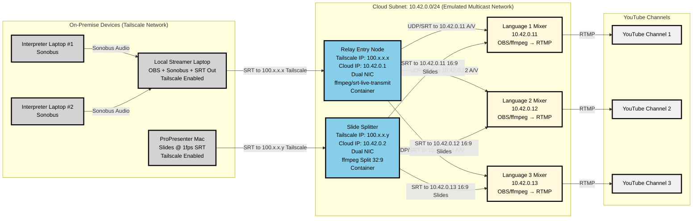

# Multilingual Streaming System Architecture

**Version:** 3.1  
**Author:** System Architecture Team  
**Date:** 2025-01-27

## Overview

This document describes the high-level architecture for a scalable, automated, and fault-tolerant streaming system that captures audio and video from distributed interpreters and presenters, relays and mixes these streams in the cloud, and distributes finalized content to multiple YouTube channels in different languages.

## System Architecture

### Network Architecture Diagram

## Component Overview

### On-Premise Infrastructure
- **Interpreter Laptops**: Capture and transmit real-time interpreter audio
- **Local Streamer**: Mix local video, presenter audio, and interpreter audio; stream to cloud
- **ProPresenter**: Output ultra-wide slide presentation for splitting and distribution

### Cloud Infrastructure
- **Relay Entry Node**: Receive high-quality A/V stream and distribute to all language mixers
- **Slide Splitter**: Convert ultra-wide slides to standard format and distribute to all mixers
- **Language Mixers**: Combine A/V and slides with language-specific audio, stream to YouTube

## Data Flow

### Audio Synchronization Strategy
- **200ms audio buffer** at each stage to maintain sync
- **Latency Compensation**: ffmpeg `-itsoffset` parameter for A/V alignment
- **Sync Monitoring**: Automated drift detection with ±50ms tolerance
- **Recovery**: Automatic buffer reset if sync drift exceeds 100ms

### Multi-Channel Audio Flow
1. **Interpreters** → Sonobus → **Local Streamer** (real-time mixing)
2. **Local Streamer** → 6-channel AAC → **Relay Entry Node** (SRT transport)
3. **Relay Entry Node** → Fan-out → **Language Mixers** (channel selection)
4. **Language Mixers** → Stereo extraction → **YouTube** (RTMP delivery)

### Bandwidth Allocation
**Upstream (Local to Cloud):**
- Local Streamer: 8 Mbps (A/V stream)
- ProPresenter: 1 Mbps (slide stream)
- **Total**: 9 Mbps minimum upload

**Cloud Internal:**
- Relay fan-out: 24 Mbps (8 Mbps × 3 mixers)
- Slide distribution: 3 Mbps (1 Mbps × 3 mixers)

**Downstream (Cloud to YouTube):**
- Per mixer: 6 Mbps RTMP upload
- **Total**: 18 Mbps upload to YouTube

## Security Architecture

### Network Security
- **Tailscale VPN**: Secure mesh network for on-premise to cloud connectivity
- **Internal Subnet**: Isolated 10.42.0.0/24 network for cloud components
- **Firewall Rules**: Strict ingress/egress controls per component

### Access Control
- **Multi-Factor Authentication**: Required for all administrative access
- **Role-Based Access**: Stream operators, system administrators, viewers
- **Secrets Management**: Ansible Vault for RTMP keys and auth tokens

## Monitoring and Operations

### Health Monitoring
- **Process Supervision**: Container orchestration with auto-restart
- **Health Checks**: Port probes, ffmpeg watchdogs, stream health validation
- **Metrics Collection**: CPU, memory, network, stream status via Prometheus
- **Dashboards**: Grafana visualization of system health and performance

### Operational Procedures
- **Startup Sequence**: 4-phase process (Infrastructure → Stream Prep → Content Sources → Go Live)
- **Failure Recovery**: Automated recovery procedures with defined RTOs
- **Quality Assurance**: Pre-stream checklists and continuous monitoring

## Deployment Strategy

### Container Orchestration
- **Azure Container Instances**: Cloud-native container deployment
- **Docker Images**: Standardized container images for each component
- **CI/CD Pipeline**: Azure DevOps with automated build, test, and deployment

### Infrastructure as Code
- **Ansible Playbooks**: Automated provisioning and configuration
- **Environment Management**: Development, staging, production environments
- **Secrets Management**: Secure handling of credentials and API keys

## Scalability and Reliability

### High Availability
- **Redundant Infrastructure**: Backup relay and splitter nodes
- **Auto-scaling**: Dynamic resource allocation based on demand
- **Geographic Distribution**: Multi-region deployment capability

### Performance Optimization
- **Stream Copy**: No transcoding for minimal latency
- **Hardware Acceleration**: GPU encoding where available
- **Network Optimization**: SRT protocol with adaptive bitrate

## Future Enhancements

### Short-term (3-6 months)
- WebRTC preview streams for operators
- Automated quality adjustment based on network conditions
- Enhanced monitoring with YouTube Analytics integration

### Medium-term (6-12 months)
- Redundant infrastructure for high availability
- AI-powered audio enhancement
- Multi-region deployment

### Long-term (12+ months)
- Kubernetes orchestration for auto-scaling
- Edge computing integration
- Real-time AI translation capabilities 